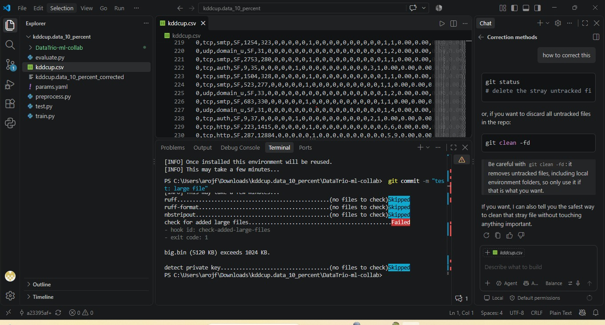

# Assignment 01: Git-Based Collaboration for an ML Project

## 1. Project Overview

**Repository:** DataTrio-ml-collab
**Team:** DataTrio
**Dataset:** KDD Cup Dataset
**Sorce Dataset:** https://www.kdd.org/kdd-cup/view/kdd-cup-1999/Data
**Starter Code Source:** https://github.com/AkshayEtukuri/KDD-Intrusion-Detection 
**Task:** Classification
**Model:** Random Forest

The objective was to develop a reproducible collaborative ML project using **Git, GitHub, DVC, DVC experiments, pull requests, code reviews, CI, and a production release**.

The workflow followed:

**Feature/Data/Experiment Branches → dev → staging → main → model-v1.0**

---

## 2. Team Members and Roles

| Member        | Role           | Contribution                                                  |
| ----------    | -----------    | -----------------------------------------------------------   |
| Rabia Asif    | Model Owner    | DVC pipeline, experiments, model development, documentation   |
| Aiman Asif    | Platform Owner | CI, repository management, branch promotion                   |
| Arooj Fatima  | Data Owner     | KDDCup dataset, data preparation, validation, DVC versioning  |

---

## 3. Dataset and Project Structure

The project uses the **KDD Cup dataset**, which was managed using **DVC** instead of storing the complete dataset in Git.

The ML code was organized under:

`src/datatrio_ml_collab/`

The repository contains source code, tests, notebooks, configuration files, DVC files, models, and GitHub Actions workflows.

---

## 4. Git Branching Strategy

The project used three main branches:

* `dev`
* `staging`
* `main`

Short-lived branches were created for features, data updates, fixes, and experiments, for example:

* `feat/dvc-pipeline`
* `data/initial-dataset`
* `feat/eda-notebook`
* `exp/rabia-max-depth`

Changes were integrated through pull requests instead of direct pushes.

---

## 5. DVC Data Versioning

The KDD dataset was added and versioned using DVC. Git tracks the DVC metadata while the actual dataset is stored through the DVC remote.

The workflow used:

`dvc add → dvc push → git add → git commit → git push`

This allows different team members to reproduce the same dataset version.

---

## 6. EDA and Reproducible Pipeline

An EDA notebook was created through a feature branch and paired with source code for easier Git collaboration.

A DVC pipeline was implemented with the following stages:

**Raw Data → Prepare Dataset → Generate Features → Train Model → Predict**

The pipeline was successfully executed and generated approximately **494,021 predictions**.

Important files include:

* `dvc.yaml`
* `dvc.lock`
* `params.yaml`

Block Screenshot: 

---

## 7. Model Experiments

Experiments were conducted using the branch:

`exp/rabia-max-depth`

Different Random Forest `max_depth` values were tested:

| max_depth | Accuracy |
| --------: | -------: |
|        10 |   0.9994 |
|        20 |   0.9998 |
|        30 |   0.9998 |

The best reported accuracy was approximately **0.9998**, with a Macro F1-score of approximately **0.70**.

The experiment results were tracked using DVC experiments.

---

## 8. Pull Requests and Collaboration

Pull requests were used to integrate feature, data, experiment, and fix branches into the shared development workflow.

Code reviews were performed before merging. The project also included a **changes-requested review**, data-update PR, and conflict-resolution PR as required by the assignment.

**Evidence/Links:**

* Changes-requested review: https://github.com/AimanAsif-56/DataTrio-ml-collab/pulls?q=is%3Apr+state%3Aopen+review%3Achanges_requested
* Conflict-resolution PR: https://github.com/AimanAsif-56/DataTrio-ml-collab/pulls

---

## 9. Merge Conflict Resolution

A merge conflict occurred in files including:

* `dvc.yaml`
* `src/datatrio_ml_collab/modeling/train.py`

The conflict was resolved by synchronizing the branch with the latest development changes and reconciling the conflicting modifications before continuing the pull request workflow.

---

## 10. CI and Repository Checks

GitHub Actions was configured to automatically perform:

1. Ruff linting
2. Formatting checks
3. Unit tests
4. Data checks
5. Smoke training

Pre-commit checks were also configured for code quality, notebook output stripping, large files, and secret detection.

---

## 11. Staging and Release

After development and CI validation, the project was promoted:

**dev → staging → main**

The final production release is represented by the tag:

`model-v1.0`

---

## 12. Reproducibility

The project was designed so that another team member can reproduce the ML pipeline from a fresh clone using:

```text
git clone <repository>
cd DataTrio-ml-collab
uv sync
dvc pull
dvc repro
```

The repository contains the required DVC files, locked dependencies, parameters, and pipeline configuration.

---

## 13. Individual Contributions

### Rabia Asif (Model Owner)

The Data Owner was responsible for managing the KDD Cup dataset throughout the project. I prepared, cleaned, and validated the dataset to ensure its quality and suitability for the machine learning pipeline. TI used DVC to version and track the dataset and managed data updates when required. I also performed data-quality checks and helped resolve data-related issues during CI and pipeline execution. My contribution ensured that the dataset remained organized, consistent, properly versioned, and reproducible for all team members. 

### Aiman Asif (Platform Owner)

I worked as the Platform/CI Owner. I contributed to the Git and GitHub repository workflow, branch management, CI configuration, and repository quality checks. I helped configure GitHub Actions for linting, tests, data checks, and smoke training, and worked on resolving CI failures related to the data checks and required sample data. I also worked on the DVC experiment setup, including configuring the project to use the correct Python environment for DVC experiments and adding the required experiment parameters. I contributed to promoting validated changes through the development and staging workflow and participated in pull requests, code reviews, merge-conflict resolution, and final integration activities. I also helped ensure that the project followed the required collaborative workflow and that the final staging branch was clean and reproducible. 

### Arooj Fatima (Data Owner)

I set up DVC for the project: I ran dvc init, tracked data/raw/kddcup.csv
on the data/initial-dataset branch (PR #<..>) and configured the shared
remote for dvc push / dvc pull. I opened the data-update PR
data/remove-duplicates (PR #<..>), which removed <N> duplicate rows
(<old rows> to <new rows>), and demonstrated the old and new data versions
with git checkout + dvc checkout. I also <wrote the data checks used in CI
(check_data.py) / fixed data-related CI failures>. Authored merged PRs:
#<..>, #<..>. Reviewed PRs: #<..>, #<..>, including one "changes requested"
review (#<..>).

---

## 14. Retrospective

The project provided practical experience with collaborative Git workflows, DVC data versioning, reproducible ML pipelines, experiments, CI, and pull requests. Challenges such as CI failures and merge conflicts were resolved during development. The project also highlighted the importance of synchronizing branches and correctly managing DVC data and Git pointers.

---

## 15. Conclusion

The **DataTrio-ml-collab** project successfully demonstrates a reproducible collaborative ML workflow using **Git, GitHub, DVC, DVC experiments, pull requests, code reviews, CI, and production release management**. The final workflow progresses from data and model development to staging and the `model-v1.0` release, providing a structured and reproducible approach to machine-learning collaboration.
